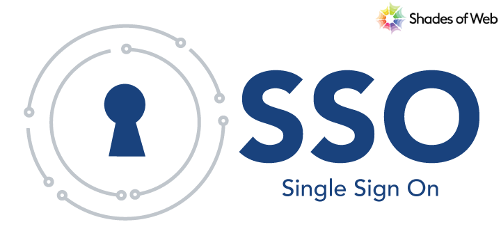

# 🌐 SAML SSO by SoW - Shades of Web's SSO Integration Hub

## Description

`SAML SSO by SoW` is a WordPress plugin that enables seamless Single Sign-On (SSO) integration between your Identity Provider (IDP) and WordPress. This cutting-edge plugin eliminates the hassle of multiple logins and streamlines user authentication across platforms. Say goodbye to login fatigue and embrace the simplicity of unified authentication with Shades of Web's SSO Integration plugin for WordPress.

## Features

- 🛠️ Seamlessly integrates SSO authentication into WordPress.
- 🔒 Supports SAML authentication protocol for secure authentication.
- 🌟 Centralizes user authentication, reducing login fatigue.
- ⚙️ Customizable settings for easy configuration.
- 🔄 Streamlines user authentication across platforms.

## Installation

1. Download the plugin to your `wp-content/plugins/` directory, or install the plugin through the WordPress plugins screen directly.
2. Activate the plugin through the 'Plugins' screen in WordPress.
3. Navigate to the 'SoW SSO' settings page in the network admin menu to configure SSO settings.

## Configuration

1. Enable the plugin and configure global toggles.
2. Specify Service Provider (SP) and Identity Provider (IDP) configurations.
3. Save your settings.

## Usage

Once configured, the plugin will handle SSO authentication for your WordPress site. Users will be able to log in using their credentials from the configured IDP.

## Frequently Asked Questions

1. **What is Single Sign-On (SSO)?**
   - Single Sign-On (SSO) is a user authentication process that allows users to access multiple applications or services with a single set of credentials.

2. **Which authentication protocol does the plugin support?**
   - The plugin supports the Security Assertion Markup Language (SAML) authentication protocol for secure SSO authentication.

## License

SoW SSO is licensed under the GPL-2.0 License. See [LICENSE](LICENSE) for more information.

## Support

For support, feature requests, or bug reports, please [submit an issue](https://github.com/shades-of-web/sow-sso/issues) on GitHub.

## Contributing

Contributions are welcome! Please read the [CONTRIBUTING.md](CONTRIBUTING.md) file for more information on how to contribute.

## Acknowledgments

- This plugin utilizes the OneLogin PHP SAML Toolkit for SAML authentication.

## Changelog

See [CHANGELOG.md](CHANGELOG.md) for version history and release notes.
